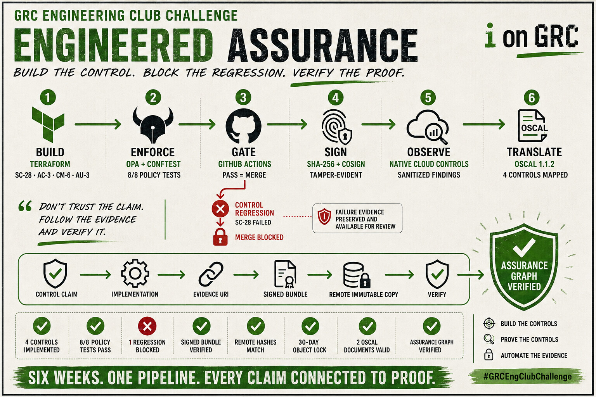
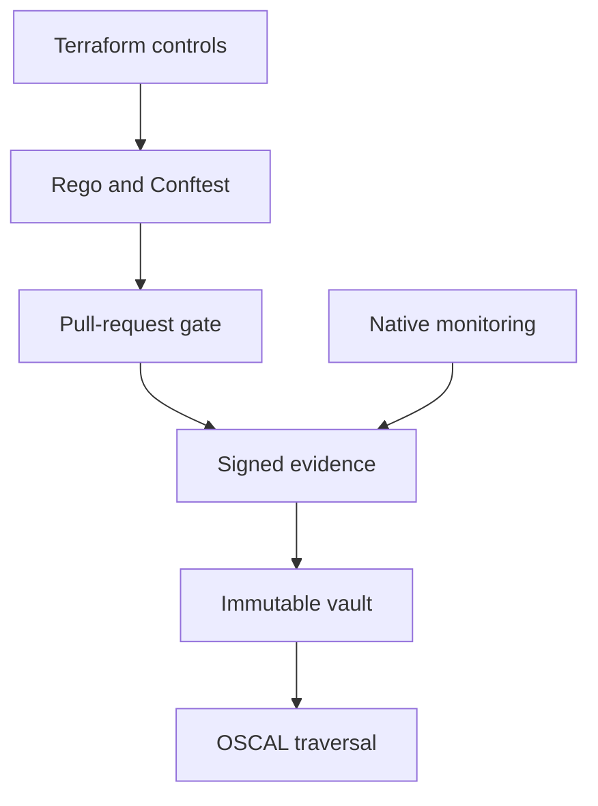

# GRC Engineering Pipeline

[](https://github.com/jtflack-grc/grc-engineering-pipeline/actions/workflows/grc-gate.yml)

An end-to-end, evidence-first demonstration of engineered assurance. Terraform defines compliant AWS storage; Rego tests the plan; GitHub Actions blocks noncompliant changes; Cosign protects both accepted and rejected decisions; AWS-native controls monitor activity; immutable storage preserves proof; and OSCAL makes each control claim traversable by an assessor.



## Choose your review path

| If you have… | Start here | What you will get |
|---|---|---|
| 60 seconds | [Portfolio case study](PORTFOLIO-CASE-STUDY.md) | The problem, six-stage design, results, limitations, and lesson learned |
| 5 minutes | [Requirements traceability](REQUIREMENTS-TRACEABILITY.md) | Every Week 1–6 requirement mapped to implementation, evidence, and verification |
| 10 minutes | [Assurance checklist](ASSURANCE-CHECKLIST.md) | A compact reviewer-oriented proof matrix |
| A terminal | [`scripts/verify-assurance-graph.sh`](scripts/verify-assurance-graph.sh) | Independent verification ending with `CHAIN INTACT` and `ASSURANCE GRAPH VERIFIED` |

## What the pipeline proves

The repository does not treat a green checkmark as the assurance conclusion. It preserves the relationship between the control claim, Terraform implementation, policy decision, workflow identity, signed evidence, immutable copy, and OSCAL reference.

That relationship is tested in both directions:

- A [compliant change](https://github.com/jtflack-grc/grc-engineering-pipeline/pull/7) passed and produced signed evidence.
- A [deliberate SC-28 regression](https://github.com/jtflack-grc/grc-engineering-pipeline/pull/15) was blocked, but its failed decision was still [bundled, hashed, signed, verified, and published](https://github.com/jtflack-grc/grc-engineering-pipeline/actions/runs/30218444910) before enforcement. The sanitized [failed archive and Cosign bundle](evidence/pull-request-gate/signed-failure/) are committed so this proof remains verifiable after the GitHub artifact expires.

## Six-stage pipeline

| Stage | Capability | Primary proof |
|---|---|---|
| 1 | Terraform implements SC-28, AC-3, CM-6, and AU-3 | [`terraform/`](terraform/) |
| 2 | Rego unit tests and Conftest evaluate the Terraform plan | [`policies/`](policies/), [`evidence/policy-tests/`](evidence/policy-tests/) |
| 3 | Pull requests are gated and fail closed | [Green PR](https://github.com/jtflack-grc/grc-engineering-pipeline/pull/7), [blocked PR](https://github.com/jtflack-grc/grc-engineering-pipeline/pull/15) |
| 4 | Successful and failed decisions are hashed, keyless-signed, and independently verified | [`generate-signed-evidence.yml`](.github/workflows/generate-signed-evidence.yml), [`evidence/signed-bundle/`](evidence/signed-bundle/), [`signed-failure/`](evidence/pull-request-gate/signed-failure/) |
| 5 | CloudTrail and Security Hub provide native monitoring evidence | [`native-monitoring/`](native-monitoring/), [`evidence/native-monitoring/`](evidence/native-monitoring/) |
| 6 | OSCAL maps control claims to resources and signed evidence | [`oscal/`](oscal/), [`sc28-traversal.txt`](evidence/oscal-validation/sc28-traversal.txt) |



## Evidence handling

Raw CloudTrail and Security Hub output was captured during the live AWS exercise but was not published because it contained account IDs, ARNs, resource names, network identifiers, tags, and other reconnaissance-quality metadata. The public repository retains sanitized summaries, signed verification results, reproducible capture code, and teardown evidence. This is a deliberate evidence-handling control, not an absent-evidence shortcut.

No AWS credentials, account identifiers, full vault bucket name, or unsanitized native findings are required for public review.

## Verify without AWS credentials

The committed evidence can be reviewed without deploying cloud resources. Terraform configurations require version `>= 1.6`; CI pins OPA `1.18.2`, Conftest `0.68.2`, and compliance-trestle `4.2.0`. The canonical signed bundles record Conftest's embedded OPA `1.15.2` and Cosign `3.0.6`. Python 3 and `jq` support the remaining verification steps.

Validate all Terraform configurations. `terraform init -backend=false` downloads providers but does not contact an AWS account:

```bash
for directory in terraform native-monitoring immutable-vault; do
  terraform -chdir="$directory" fmt -check
  terraform -chdir="$directory" init -backend=false
  terraform -chdir="$directory" validate
done
```

Run the policy tests and evaluate all four control namespaces:

```bash
opa test policies -v
conftest test evidence/policy-tests/terraform-plan.json --policy policies --namespace compliance.sc28_aws
conftest test evidence/policy-tests/terraform-plan.json --policy policies --namespace compliance.ac3_aws
conftest test evidence/policy-tests/terraform-plan.json --policy policies --namespace compliance.au3_aws
conftest test evidence/policy-tests/terraform-plan.json --policy policies --namespace compliance.cm6_aws
```

Validate OSCAL and traverse the complete assurance graph:

```bash
python3 -m venv .venv
source .venv/bin/activate
pip install compliance-trestle==4.2.0

cd oscal
trestle validate -f component-definitions/grc-engineering-pipeline/component-definition.json
trestle validate -f profiles/grc-engineering-pipeline/profile.json
cd ..

./scripts/verify-assurance-graph.sh
```

Expected results:

- OPA reports `PASS: 8/8`.
- Each Conftest namespace passes.
- Both OSCAL documents report `VALID`.
- The evidence verifier reports `CHAIN INTACT`.
- The graph verifier reports `ASSURANCE GRAPH VERIFIED`.

The complete credentialed paths are documented separately:

- [`native-monitoring/README.md`](native-monitoring/README.md) covers CloudTrail, Security Hub, sanitized capture, signing, and teardown.
- [`immutable-vault/README.md`](immutable-vault/README.md) covers Object Lock upload, exact-version download, remote re-hashing, retention verification, and safe teardown.

## Repository map

| Path | Purpose |
|---|---|
| [`terraform/`](terraform/) | Compliant S3 implementation and live verification helper |
| [`policies/`](policies/) | Rego controls and positive/negative unit tests |
| [`.github/workflows/`](.github/workflows/) | PR enforcement, evidence generation, signing, verification, and publication |
| [`evidence/`](evidence/) | Retained policy, PR, signature, monitoring, OSCAL, and vault proof |
| [`native-monitoring/`](native-monitoring/) | CloudTrail and Security Hub implementation and capture scripts |
| [`immutable-vault/`](immutable-vault/) | Private Object Lock evidence preservation |
| [`oscal/`](oscal/) | Four-control profile and component definition |
| [`scripts/`](scripts/) | Evidence-chain and assurance-graph verification |

## OSCAL traversal

1. Open the [profile](oscal/profiles/grc-engineering-pipeline/profile.json) and confirm that it selects exactly `ac-3`, `au-3`, `cm-6`, and `sc-28`.
2. Open the [component definition](oscal/component-definitions/grc-engineering-pipeline/component-definition.json) and locate the `sc-28` implemented requirement.
3. Follow its `rel: evidence` link to the canonical signed archive.
4. Run the assurance-graph verifier to reconcile the control scope, evidence URI, signed manifest, workflow identity, input hashes, archive and signature hashes, and immutable-vault record.

For the complete requirement-by-requirement audit, see [`REQUIREMENTS-TRACEABILITY.md`](REQUIREMENTS-TRACEABILITY.md).
